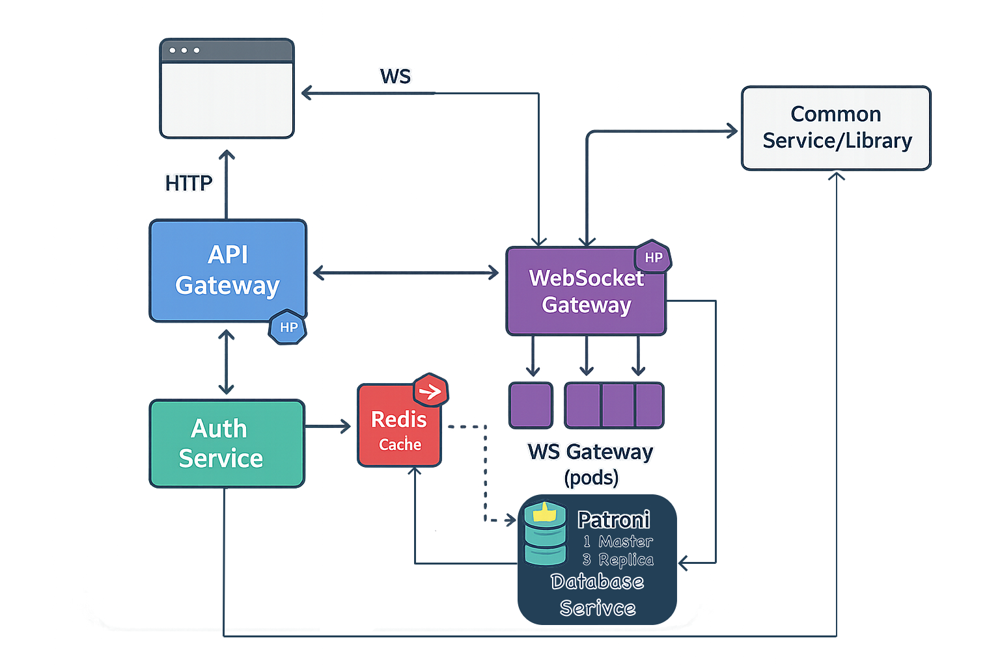

# Distributed-Chat-System

## Overview

This project demonstrates the design and implementation of a **microservices-driven distributed chat system**.  
The focus is on showcasing production-grade architecture patterns such as **API & WebSocket gateways, service decomposition, caching, high-availability PostgreSQL with Patroni, Redis Pub/Sub messaging, JWT authentication, and horizontal scaling with Kubernetes HPA**.

> **Note:** This project is intended as a portfolio-ready demonstration of microservices architecture.  

> While it can be extended into a real product, its primary purpose is to highlight **system design, scalability, and service communication patterns**.

### Table of Contents
- [Introduction](#introduction)
- [Why This Project](#why-this-project)
- [High-Level Architecture](#high-level-architecture)
- [Core Concepts & Data Flows](#core-concepts--data-flows)
- [Service Breakdown](#service-breakdown)
- [Data Layer & Caching](#data-layer--caching)
- [Messaging Layer](#messaging-layer)
- [Security Model](#security-model)
- [Scalability & Resilience](#scalability--resilience)
- [Observability](#observability)
- [Tech Stack](#tech-stack)
- [Project Structure](#project-structure)
- [Setup & Deployment](#setup--deployment)
- [License](#license)  
<!--- [Limitations & Non-Goals](#limitations--non-goals)
- [Roadmap](#roadmap) -->

---

## Introduction

The **Distributed Chat System** is a microservices-based application designed to demonstrate how modern, production-grade chat platforms can be architected.  

It is built with a service-oriented approach where responsibilities are split across independent components such as API Gateway, WebSocket Gateway, Authentication, Database Service, and a shared Common Library.

The system highlights key concepts in **scalability, fault tolerance, real-time messaging, and secure communication** by combining technologies like **Node.js, Astro + React, Redis, PostgreSQL with Patroni, and Kubernetes HPA**.

While the project is primarily aimed at showcasing **system design and microservices communication**, its architecture is extendable enough to evolve into a real-world product.

## Why This Project

The primary goal of this project is to **demonstrate microservices architecture in action** through a familiar use case: a real-time chat system.  

Instead of building a simple monolithic chat app, this project breaks down the system into **independent, loosely coupled services** that communicate through well-defined gateways and messaging layers.

This approach highlights:
- How **microservices can be orchestrated** to handle real-time communication at scale.
- The use of **Redis Pub/Sub** for WebSocket message fan-out across multiple pods.
- **High Availability (HA) databases** with PostgreSQL + Patroni for resilience.
- **Horizontal scaling** using Kubernetes HPA to handle traffic spikes.
- **Secure communication** with JWT-based authentication and encrypted messages.

Ultimately, this project is not a consumer product, but a **portfolio-grade demonstration** aimed at showcasing system design skills, distributed communication patterns, and production-ready practices to hiring managers and peers.

---

## High-Level Architecture

At a high level, the Distributed Chat System is composed of multiple **independent microservices** that communicate through gateways and shared infrastructure.

Clients interact with the system either via **HTTP requests through the API Gateway** (for authentication, database access, and REST endpoints) or via **WebSocket connections through the WS Gateway** (for real-time chat messaging).

The **API Gateway** routes requests to the **Auth Service** (for JWT issuance/validation) or the **Database Service**, which implements a **cache-first strategy** using Redis and falls back to PostgreSQL for persistence.

The **WebSocket Gateway** maintains client connections and leverages **Redis Pub/Sub** to broadcast messages across all active WS pods, ensuring horizontal scalability.

A **Common Library** is shared across services to maintain consistent types, utilities, and logic.

Underlying all of this, the **PostgreSQL cluster managed by Patroni** ensures high availability with one master and multiple replicas, while **Kubernetes HPA** dynamically scales stateless services based on load.



---

## Core Concepts & Data Flows

This section explains how core operations move through the distributed system:

### 1. Authentication Flow
1. A client logs in via the **API Gateway**.
2. The **Auth Service** validates credentials and issues a **JWT**.
3. The JWT is returned to the client and attached to all subsequent requests.
4. Gateways and services validate the JWT before processing any request.

```text
AUTHENTICATION FLOW
───────────────────
Browser (Client)
└─> API Gateway (HTTP /login, /register)
└─> Auth Service
├─ Validate credentials
├─ Issue JWT (signed)
└─ Return JWT
└─<── JWT back to API Gateway
└─<── JWT back to Browser (store; attach to future requests)

[On every request / WS upgrade]
Browser ──(Authorization: Bearer <JWT>)──> API/WS Gateway
API/WS Gateway ──> Auth Service (validate JWT; claims/expiry)
API/WS Gateway ──> Continue if valid | 401 if invalid
```

### 2. Database Access Flow
1. Clients send data queries via the **API Gateway**.
2. Requests are routed to the **Database Service**, which implements a **cache-first approach**:
    - Query Redis cache → if hit, return immediately.
    - If miss, query the **PostgreSQL cluster** (managed by Patroni).
3. Database responses are written back into Redis to optimize subsequent lookups.
4. This ensures **low latency** while maintaining **strong consistency** through the HA PostgreSQL backend.

```text
DATA ACCESS (CACHE-FIRST) FLOW
──────────────────────────────
Browser (Client)
  └─> API Gateway (HTTP /messages, /users, etc.)
        └─> Database Service
              ├─ Query Redis (cache) ── hit? ──┐
              │                               │
              └─ miss ──> PostgreSQL (Patroni cluster)
                           ├─ Leader (writes)
                           └─ 3 Replicas (reads)
                         <── Result from Postgres
              └─ Write-through: set Redis with fresh data (TTL)
        └─<── Response from Database Service
  └─<── JSON back to Browser

Notes:
- Patroni ensures HA/failover: 1 leader + 3 replicas.
- Reads can be served via replicas as needed; writes go to leader.
```

### 3. Real-Time Messaging Flow
1. A client connects to the system via **WebSocket Gateway**.
2. When a message is sent:
    - The WS Gateway publishes the message event into **Redis Pub/Sub**.
    - All WS Gateway pods subscribed to the channel receive the message.
3. Each WS pod delivers the event to the relevant connected clients in real-time.
4. This design enables **horizontal scaling** of WebSocket servers while ensuring **consistent message fan-out** across pods.

```text
REAL-TIME MESSAGING (WS + PUB/SUB) FLOW
───────────────────────────────────────
Browser (Client)
  └── WebSocket connect ──> WS Gateway (pod A/B/C…)
        ├─ Authenticate (JWT on WS upgrade)
        └─ Join room/channel subscriptions

[Send message]
Browser ──(WS send)──> WS Gateway (pod X)
  └─ WS Gateway (pod X) ──> Redis Pub/Sub (PUBLISH room:<id> payload)
        ├─ WS Gateway (pod A) ── SUBSCRIBE room:<id> ──> deliver to its clients in room
        ├─ WS Gateway (pod B) ── SUBSCRIBE room:<id> ──> deliver to its clients in room
        └─ WS Gateway (pod C) ── SUBSCRIBE room:<id> ──> deliver to its clients in room

[Receive message]
All connected clients in room:<id> across pods receive the event in real time.

Notes:
- Horizontal scaling: add more WS pods, all subscribe to the same Redis channels.
- Pub/Sub ensures fan-out across pods; no sticky session requirement between senders/receivers.

```
```text
LEGEND
──────
└─>   Flow of request or message
<──   Response / return path
├─    Branch of logic (multiple possible outcomes)
[…]   Metadata (e.g., JWT, TTL)
( )   Protocols or payloads (HTTP, WS, JSON, Pub/Sub)
```

---

## Service Breakdown

The system is decomposed into independent microservices, each with a clear responsibility:

### API Gateway
- The entry point for all **HTTP requests** (e.g., authentication, data queries). 
- It validates JWTs, routes requests to the correct service, and enforces access control. 
- By separating request routing from business logic, the API Gateway provides a **clean contract** for clients.

### WebSocket (WS) Gateway
- Dedicated to handling **real-time connections**.
- Each pod manages active WebSocket sessions, authenticates clients on upgrade, and subscribes to Redis Pub/Sub channels. 
- Messages published by one pod are broadcast to all pods, enabling **horizontal scalability** without sticky sessions.

### Auth Service
- Responsible for **user authentication and authorization**. 
- It validates credentials, issues JWT tokens, and verifies them on behalf of other services. 
- This separation ensures that **security logic is centralized** and consistent across the system.

### Database Service
- Implements the **cache-first data access layer**. 
- It queries Redis first, falling back to PostgreSQL (Patroni cluster) when necessary, and writes results back to Redis. 
- This design balances **low-latency reads** with **strong persistence guarantees**.

### Common Library
- A shared codebase imported by all services. 
- It contains **types, encryption utilities, and common business logic**, ensuring consistency and reducing duplication. 
- This approach makes the microservices **easier to maintain and evolve**.

---

## Data Layer & Caching

The system uses a **two-tiered data architecture** to balance speed and reliability:

### Redis (Cache Layer)
- Acts as the **first lookup point** for all database queries.
- Stores frequently accessed data (e.g., user profiles, chat history lookups) with a **TTL-based eviction policy**.
- Provides **sub-millisecond response times**, significantly reducing load on the primary database.
- Acts as both:
   - **Cache** → for query acceleration.
   - **Pub/Sub broker** → for WebSocket fan-out across multiple pods.

### PostgreSQL with Patroni (Persistence Layer)
- The source of truth for all **persistent data** (users, rooms, messages).
- Deployed as a **high-availability cluster** managed by **Patroni**:
   - **1 leader node** handles all writes.
   - **3 replicas** handle read queries and automatically sync with the leader.
   - **Automatic failover** ensures a replica is promoted if the leader fails.
- This design ensures the database is **always available**, even under node failures.

### Cache-First Strategy
1. On query:
   - Check Redis cache.
   - If hit → return immediately.
   - If miss → query PostgreSQL, then write result back into Redis with TTL.
2. On write/update:
   - PostgreSQL leader is updated.
   - Corresponding Redis keys are invalidated or updated to ensure consistency.

This hybrid approach allows the system to achieve **low-latency reads** while maintaining **strong durability guarantees** with PostgreSQL.

---

## Messaging Layer

Real-time delivery is handled by a dedicated **WebSocket (WS) Gateway** tier, scaled horizontally behind a load balancer.  
Each Gateway pod maintains client connections and communicates across pods using **Redis Pub/Sub**.

### How it Works
1. **Client connects** to any WS Gateway pod (JWT validated during the WS upgrade).
2. **Join subscriptions**: the client subscribes to room/channel topics (e.g., `room:<id>`).
3. **Send message**: the receiving pod **PUBLISH**es the event to Redis on the topic `room:<id>`.
4. **Fan-out**: all WS Gateway pods **SUBSCRIBE** to the same topics and deliver the event to their locally connected clients in that room.
5. **Scale-out**: adding more WS pods increases concurrent connection capacity without sticky sessions.
6. **Socket Identifier**: The `wsID` is the Socket ID to identify and fanout to others gateways expect self. 

### Topics & Payloads (convention)
- **Topics**: `room:<roomId>`, `user:<userId>` (for DMs or targeted updates if needed).
- **Message payload** (example):
```json
  {
    "type": "message",
    "roomId": "<id>",
    "messageId": "<uuid>",
    "senderId": "<user-id>",
    "senderName": "<user-name>",
    "message": "<content>",
    "wsID": "<iso8601>"
  }
```

### Delivery Semantics
- At-least-once delivery within a room across pods (due to Pub/Sub broadcast). 
- Best-effort ordering (Redis Pub/Sub does not guarantee total order across pods). 
- Idempotency can be achieved at the client using messageId de-duplication if required.

### Backpressure & Reconnects
- Stateless pods: clients can reconnect to any pod; subscriptions are re-established after auth.
- Rate limits at the Gateway can be applied (per connection / per room) to protect Redis and downstream services. 
- Why this design?

### Simplicity: Redis Pub/Sub keeps cross-pod signaling straightforward.
- Scalability: Horizontal scaling of WS Gateways handles spikes in active connections. 
- No sticky sessions: Any pod can handle any client; broadcasts reach all pods via Redis.

---

## Security Model

The system applies multiple layers of security: **transport security**, **token-based access control**, and **client-side message encryption** (pseudo-E2EE).

### 1) Transport & Perimeter
- **TLS** is expected for all external traffic (HTTPS/WSS) to protect data in transit.
- Gateways terminate TLS and forward traffic to internal services over the cluster network.

### 2) Authentication & Authorization (JWT)
- **JWT**s are issued by the **Auth Service** after login.
- Gateways validate JWTs on **every HTTP request and WS upgrade** (signature + expiry).
- Claims (e.g., `sub`, `role`, `scopes`) inform **route-level authorization** at the API Gateway and WS Gateway.
- Token lifecycle can be extended via **short-lived access tokens** + **(optional) refresh tokens**.

### 3) Message Encryption (Pseudo-E2EE via Envelope Encryption)
- **Goal:** prevent casual introspection of message content outside intended recipients.
- **Mechanism:**
    1. A **random content key** (symmetric) is generated per message.
    2. The plaintext message is encrypted **with the content key**.
    3. The **content key is then encrypted** with either:
        - the recipient user’s key (**DM / user-scoped**), or
        - a **room-shared key** (channel-scoped).
    4. Payload delivered contains: `{ ciphertext, encryptedContentKey, metadata }`.
- **Where it falls short of true E2EE:**
    - **Key management & exchange** are **not** fully zero-trust; servers may participate in distributing/holding room keys.
    - Without audited client-only key storage and verified out-of-band exchange, servers could theoretically access keys.
    - Therefore, this is **“E2EE-like” hardening**, not strict end-to-end encryption.

### 4) Key Management (Current State)
- **User keys** or **room keys** are assumed to be provisioned/derived by the application and available at encryption time.
- **Rotation:** keys can be rotated by publishing a new room key and re-wrapping future messages.
- **Revocation:** remove a user from a room and rotate the room key to prevent future decryption (past messages remain decryptable unless re-encrypted).

### 5) Gateway Enforcement & Rate Limiting
- API/WS Gateways enforce **JWT checks**, **basic rate limits**, and **payload size caps** to mitigate abuse.
- WS Gateway validates **room membership** before subscribing a client to a topic.

### 6) Data at Rest
- **PostgreSQL** stores message blobs and metadata; at rest encryption can be enabled at the disk/storage layer.
- **Redis** holds transient data and pub/sub events; do **not** treat Redis as a secure secret store.

### 7) Threat Model & Limitations
- **Protected against:** on-path network snooping (TLS), unauthenticated access (JWT), cross-pod message leakage (topic scoping).
- **Not fully protected against:** a compromised server/cluster that can access **room keys**; malicious client that legitimately holds keys; **global ordering/dup** attacks inherent to Pub/Sub.
- **Future hardening:** audited client-only key storage, verified key exchange (e.g., X3DH/Double-Ratchet), per-device identity, secure enclaves/HSM for server-side secrets, structured permission scopes.

> **Summary:** The design provides practical defense-in-depth for a portfolio project, with **JWT-based access control** and **envelope-encrypted messages**. It is **not strict E2EE** due to current key management assumptions, and the README documents these trade-offs transparently.

---

## Scalability & Resilience

This system is designed to **scale horizontally** and **degrade gracefully** under failures.

### Horizontal Scaling
- **Stateless Gateways**: API & WS Gateways are stateless → scale out/in via **Kubernetes HPA** with no sticky sessions.
- **WS Fan-out**: Adding WS pods increases concurrent connections; **Redis Pub/Sub** keeps broadcasts consistent across pods.
- **Database Reads**: **PostgreSQL replicas** handle read traffic; leader handles writes.

### Autoscaling (HPA)
- **API/WS**: scale on CPU + (optionally) custom metrics (RPS, active WS connections).
- **DB Service**: scale on CPU + latency percentiles (P95/P99) to protect Postgres.
- **Policies**: min/max replicas set to cap cost and prevent thrash (e.g., cool-down windows).

### Caching & Load Shedding
- **Cache-first** design: Redis absorbs read bursts, reducing DB load.
- **TTL tuning** balances staleness vs. load.
- **Backpressure**: WS Gateway rate-limits senders per-connection/room; API Gateway enforces payload caps.
- **Circuit Breakers/Timeouts** (recommended): fail fast on unhealthy deps to avoid cascade failures.

### High Availability (HA)
- **Patroni** provides leader election & **automatic failover** (1 leader + 3 replicas).
- **Rolling Updates**: Pods updated with **zero downtime** (readiness/liveness probes; surge/partition upgrades).
- **Redis**: use managed/clustered Redis or sentinel-mode for HA in production (documented as a future hardening).

### Failure Modes & Behavior
- **WS Pod Loss**: clients reconnect to another pod; subscriptions re-established post-auth.
- **Redis Outage**:
    - Cache: API falls back to Postgres (higher latency).
    - Pub/Sub: WS fan-out degrades to single-pod delivery (broadcast paused across pods) until Redis recovers.
- **DB Leader Failure**: Patroni promotes a replica; brief write unavailability, reads continue from remaining replicas.

### Capacity Planning (Guidelines)
- **API**: scale target around CPU 60–70% or P95 latency SLO.
- **WS**: scale target by **active connections** (e.g., 3–5k per pod baseline) + CPU.
- **DB**: keep leader write IOPS below safe threshold; move heavy reads to replicas; ensure sufficient **buffer cache**.

> **Result:** linear scale-out for gateways, HA for storage, and controlled degradation under dependency failures—suited for real-time chat loads and interview-ready system design demos.

---

## Observability

This project treats observability as a first-class feature: **metrics, logs, and traces** are emitted by every service.  
Because pods are ephemeral (rollouts/auto-scaling), **metrics are pushed every 10s to a Prometheus Pushgateway** (“pull gateway”), and the main Prometheus server **scrapes the Pushgateway**. This ensures continuity of metrics across restarts.

> Setup specifics (Prometheus, Pushgateway, Grafana, scrape jobs) live in `setup.md`.  
> Here we define **what** we observe and **which signals** matter.

### Metrics (what we expose)
All services push **Prometheus** counters/gauges/histograms every **10s** with labels:
`service`, `pod`, `namespace`, `version`, `route`/`topic` (where relevant).

#### API Gateway
- `api_requests_total{route,method,code}` — total HTTP requests.
- `api_request_duration_seconds_bucket{route,method}` — request latency (histogram).
- `api_active_requests{route}` — inflight requests (gauge).
- `api_jwt_validation_total{outcome="ok|fail|expired"}` — JWT checks.
- `api_rate_limit_blocks_total{route}` — requests blocked by rate limiting.

#### WS Gateway
- `ws_active_connections` — current connections per pod.
- `ws_messages_sent_total{topic}` / `ws_messages_received_total{topic}` — fan-out volume.
- `ws_publish_duration_seconds_bucket{topic}` — time to publish to Redis.
- `ws_reconnects_total` — client reconnects (useful during rollouts/incidents).
- `ws_backpressure_events_total{reason}` — sends dropped/deferred.

#### Auth Service
- `auth_logins_total{outcome}` — login attempts.
- `auth_jwt_issued_total` — tokens minted.
- `auth_latency_seconds_bucket{operation}` — e.g., password verify, token sign.

#### Database Service
- `db_cache_hits_total{entity}` / `db_cache_misses_total{entity}` — Redis hit ratio.
- `db_query_latency_seconds_bucket{entity,op}` — logical read/write timings (app view).
- `db_invalidation_total{entity}` — cache invalidations.

#### Redis (Cache & Pub/Sub)
- `redis_pubsub_publish_total{channel}` — publishes by channel.
- `redis_errors_total{op}` — timeouts/conn errors.
- **From Redis exporter**: `redis_connected_clients`, `redis_memory_used_bytes`, `redis_uptime_in_seconds`, `redis_commands_total`.

#### PostgreSQL (Patroni Cluster)
- **From postgres exporters**:
    - `pg_up` — exporter health.
    - `pg_stat_activity_count{state}` — active/idle connections.
    - `pg_xlog_location_bytes` / `pg_wal_lag_bytes` — replica lag.
    - `pg_table_bloat_estimate_bytes` (if enabled) — capacity red flags.
    - `pg_locks_count{mode}` — lock pressure.
    - `pg_stat_database_blks_hit/blks_read` — cache hit ratio.
- **From Patroni exporter**:
    - `patroni_cluster_member_role{member="…"} 1` — leader/replica role.
    - `patroni_failovers_total` — failover count.

#### Process/Infra (common)
- `process_cpu_seconds_total`, `process_resident_memory_bytes`.
- `nodejs_eventloop_lag_seconds` (Node.js runtime).
- `container_cpu_usage_seconds_total`, `container_memory_working_set_bytes` (cAdvisor, if enabled).

### Push Model (how we send)
- Every service **pushes to Pushgateway every 10s** using a `job` like:  
  `job="distributed-chat", service="<api|ws|auth|db>", pod="<pod-name>", version="<git-sha>"`
- Prometheus **scrapes Pushgateway** on its regular interval (e.g., 15s).
- On **graceful shutdown**, services **issue a `DELETE` to Pushgateway** for their job to prevent metric staleness.  
  (If a pod dies abruptly, a cleanup job or TTL janitor should remove stale series — see `setup.md`.)

> Why Pushgateway? Pods start/stop during HPA rollouts; in-pod `/metrics` would disappear between scrapes, losing continuity. Pushgateway buffers the latest snapshot so Prometheus can still pull.

### Logging (structured)
- **JSON logs** with: `ts`, `level`, `service`, `pod`, `trace_id`, `span_id`, `request_id`, `user_id` (when known), `route`/`topic`, `latency_ms`, `status`, `msg`.
- Gateway logs include **request summaries**; WS logs include **connect/disconnect** and **room join/leave** events.
- Recommend centralization via Loki/ELK/Cloud provider (details in `setup.md`).

### Tracing (OpenTelemetry)
- **OTel SDK** in Node.js services (API, WS, Auth, DB Service).
- Propagate `traceparent` across HTTP/WS boundaries; annotate Redis publish/subscribe as child spans.
- Export to **OTel Collector** → **Tempo/Jaeger** (configured in `setup.md`).
- Key spans:
    - API request → JWT verify → DB/cache ops.
    - WS message → publish → deliveries across pods.
    - DB query spans with SQL tags (sanitized).

### SLOs & Alerts (examples)
- **API Latency SLO**: P95 `< 200ms` for read endpoints, `< 400ms` for writes.
    - Alert if `api_request_duration_seconds:95p{route=~"GET.*"}` > 200ms for 5m.
- **Error Rate**: 5xx ratio > 1% for 5m per route.
- **WS Capacity**: `ws_active_connections` per pod > target (e.g., 5k) → scale up.
- **Redis Health**: memory usage > 80%, or `redis_errors_total` increasing.
- **Postgres**: replica lag > 1s; locks > threshold; connection saturation > 85%.
- **Patroni**: leader missing > 30s; failover event fired.
- **Pushgateway Hygiene**: stale series detector (series with `pod` label not seen in K8s for N minutes).

### Dashboards (Grafana)
- **API**: RPS, P50/95/99, error rate, top routes, inflight.
- **WS**: active conns, publishes/sec, deliver/sec, backpressure, reconnects.
- **Cache**: hit rate by entity, Redis CPU/mem, ops/sec.
- **DB**: QPS (reads/writes), latency histograms, replica lag, locks.
- **Infra**: pod CPU/mem, restarts, HPA status.

> **Outcome:** Even during rolling updates and auto-scaling, you retain **continuous metrics (via Pushgateway), searchable logs, and end-to-end traces**, enabling fast debugging and clear performance storytelling.

---

## Observability

This project treats observability as a first-class feature: **metrics, logs, and traces** are emitted by every service.  
Because pods are ephemeral (rollouts/auto-scaling), **metrics are pushed every 10s to a Prometheus Pushgateway** (“pull gateway”), and the main Prometheus server **scrapes the Pushgateway**. This ensures continuity of metrics across restarts.

> Setup specifics (Prometheus, Pushgateway, Grafana, scrape jobs) live in `setup.md`.  
> Here we define **what** we observe and **which signals** matter.

### Metrics (what we expose)
All services push **Prometheus** counters/gauges/histograms every **10s** with labels:
`service`, `pod`, `namespace`, `version`, `route`/`topic` (where relevant).

#### API Gateway
- `api_requests_total{route,method,code}` — total HTTP requests.
- `api_request_duration_seconds_bucket{route,method}` — request latency (histogram).
- `api_active_requests{route}` — inflight requests (gauge).
- `api_jwt_validation_total{outcome="ok|fail|expired"}` — JWT checks.
- `api_rate_limit_blocks_total{route}` — requests blocked by rate limiting.

#### WS Gateway
- `ws_active_connections` — current connections per pod.
- `ws_messages_sent_total{topic}` / `ws_messages_received_total{topic}` — fan-out volume.
- `ws_publish_duration_seconds_bucket{topic}` — time to publish to Redis.
- `ws_reconnects_total` — client reconnects (useful during rollouts/incidents).
- `ws_backpressure_events_total{reason}` — sends dropped/deferred.

#### Auth Service
- `auth_logins_total{outcome}` — login attempts.
- `auth_jwt_issued_total` — tokens minted.
- `auth_latency_seconds_bucket{operation}` — e.g., password verify, token sign.

#### Database Service
- `db_cache_hits_total{entity}` / `db_cache_misses_total{entity}` — Redis hit ratio.
- `db_query_latency_seconds_bucket{entity,op}` — logical read/write timings (app view).
- `db_invalidation_total{entity}` — cache invalidations.

#### Redis (Cache & Pub/Sub)
- `redis_pubsub_publish_total{channel}` — publishes by channel.
- `redis_errors_total{op}` — timeouts/conn errors.
- **From Redis exporter**: `redis_connected_clients`, `redis_memory_used_bytes`, `redis_uptime_in_seconds`, `redis_commands_total`.

#### PostgreSQL (Patroni Cluster)
- **From postgres exporters**:
    - `pg_up` — exporter health.
    - `pg_stat_activity_count{state}` — active/idle connections.
    - `pg_xlog_location_bytes` / `pg_wal_lag_bytes` — replica lag.
    - `pg_table_bloat_estimate_bytes` (if enabled) — capacity red flags.
    - `pg_locks_count{mode}` — lock pressure.
    - `pg_stat_database_blks_hit/blks_read` — cache hit ratio.
- **From Patroni exporter**:
    - `patroni_cluster_member_role{member="…"} 1` — leader/replica role.
    - `patroni_failovers_total` — failover count.

#### Process/Infra (common)
- `process_cpu_seconds_total`, `process_resident_memory_bytes`.
- `nodejs_eventloop_lag_seconds` (Node.js runtime).
- `container_cpu_usage_seconds_total`, `container_memory_working_set_bytes` (cAdvisor, if enabled).

### Push Model (how we send)
- Every service **pushes to Pushgateway every 10s** using a `job` like:  
  `job="distributed-chat", service="<api|ws|auth|db>", pod="<pod-name>", version="<git-sha>"`
- Prometheus **scrapes Pushgateway** on its regular interval (e.g., 15s).
- On **graceful shutdown**, services **issue a `DELETE` to Pushgateway** for their job to prevent metric staleness.  
  (If a pod dies abruptly, a cleanup job or TTL janitor should remove stale series — see `setup.md`.)

> Why Pushgateway? Pods start/stop during HPA rollouts; in-pod `/metrics` would disappear between scrapes, losing continuity. Pushgateway buffers the latest snapshot so Prometheus can still pull.

### Logging (structured)
- **JSON logs** with: `ts`, `level`, `service`, `pod`, `trace_id`, `span_id`, `request_id`, `user_id` (when known), `route`/`topic`, `latency_ms`, `status`, `msg`.
- Gateway logs include **request summaries**; WS logs include **connect/disconnect** and **room join/leave** events.
- Recommend centralization via Loki/ELK/Cloud provider (details in `setup.md`).

### Tracing (OpenTelemetry)
- **OTel SDK** in Node.js services (API, WS, Auth, DB Service).
- Propagate `traceparent` across HTTP/WS boundaries; annotate Redis publish/subscribe as child spans.
- Export to **OTel Collector** → **Tempo/Jaeger** (configured in `setup.md`).
- Key spans:
    - API request → JWT verify → DB/cache ops.
    - WS message → publish → deliveries across pods.
    - DB query spans with SQL tags (sanitized).

### SLOs & Alerts (examples)
- **API Latency SLO**: P95 `< 200ms` for read endpoints, `< 400ms` for writes.
    - Alert if `api_request_duration_seconds:95p{route=~"GET.*"}` > 200ms for 5m.
- **Error Rate**: 5xx ratio > 1% for 5m per route.
- **WS Capacity**: `ws_active_connections` per pod > target (e.g., 5k) → scale up.
- **Redis Health**: memory usage > 80%, or `redis_errors_total` increasing.
- **Postgres**: replica lag > 1s; locks > threshold; connection saturation > 85%.
- **Patroni**: leader missing > 30s; failover event fired.
- **Pushgateway Hygiene**: stale series detector (series with `pod` label not seen in K8s for N minutes).

### Dashboards (Grafana)
- **API**: RPS, P50/95/99, error rate, top routes, inflight.
- **WS**: active conns, publishes/sec, deliver/sec, backpressure, reconnects.
- **Cache**: hit rate by entity, Redis CPU/mem, ops/sec.
- **DB**: QPS (reads/writes), latency histograms, replica lag, locks.
- **Infra**: pod CPU/mem, restarts, HPA status.

> **Outcome:** Even during rolling updates and auto-scaling, you retain **continuous metrics (via Pushgateway), searchable logs, and end-to-end traces**, enabling fast debugging and clear performance storytelling.

---

## Tech Stack

### Backend
- **Node.js + TypeScript** — service runtime (API, WS, Auth, DB)
- **OpenTelemetry** — tracing & context propagation
- **Prometheus** — metrics collection (via Pushgateway)
- **Redis** — cache + Pub/Sub broker
- **PostgreSQL + Patroni** — HA relational database cluster

### Frontend
- **Astro + React** — minimal UI for auth & chat flows

### Infrastructure
- **Docker** — containerization for all services
- **Kubernetes (HPA + probes)** — orchestration & autoscaling
- **Grafana** — dashboards for metrics & SLOs

---

Perfect 👌 here’s a **clean `Project Structure` section** in Markdown format that highlights the important parts without overwhelming detail:

## Project Structure

```
├── Backend
│   ├── api-gateway/         # Entry point for HTTP requests (JWT validation, routing)
│   ├── auth-service/        # Authentication + JWT issuance/validation
│   ├── db-service/          # Cache-first DB layer (Redis + PostgreSQL/Patroni)
│   ├── ws-gateway/          # WebSocket connections + Redis Pub/Sub fan-out
│   ├── services/            # Shared library (cache, Pub/Sub, logger, utils)
│   └── nginx.conf           # Reverse proxy config
│
├── Frontend/                # Astro + React frontend (chat UI)
│   ├── src/components/      # Chat UI + WebSocket client
│   ├── src/pages/           # Routes (index + room views)
│   └── astro.config.mjs
│
├── k8s/                     # Kubernetes manifests
│   └── prouction-deployment/
│       ├── namespace.yml
│       └── patroni-psql.yml
│
├── images/                  # Architecture diagrams
├── docker-compose.yml        # Local multi-service setup
├── docker-compose-test.yml   # Lightweight test setup
├── logs/                     # Service logs (gitignored in practice)
├── init-repl.sh              # Dev utility script
├── precheck.sh               # Pre-deployment checks
├── LICENSE
└── README.md
```
---

## Setup & Deployment

Refer to [SETUP.md](./SETUP.md) for detailed **local (Docker Compose)** and **Kubernetes (production)** deployment steps.

---

## License

This project is licensed under the terms of the [MIT License](./LICENSE).
